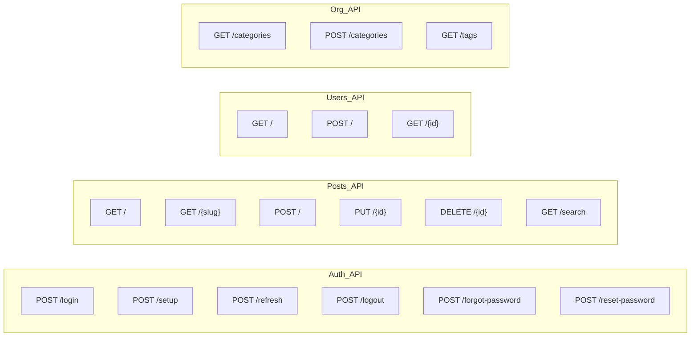

# API Architecture

> REST API design patterns and endpoint structure for The Replicant.

---

## API Design Principles

1. **RESTful** — Resources with standard HTTP methods
2. **Versioned** — `/api/v1/` prefix for future compatibility
3. **JSON** — All requests/responses in JSON format
4. **OpenAPI** — Contract-first development with spec file
5. **RFC 7807** — Problem Details for error responses

---

## Endpoint Overview



---

## Request/Response Formats

### Standard Success Response

```json
{
  "data": { ... },
  "meta": {
    "timestamp": "2026-01-19T12:00:00Z"
  }
}
```

### Paginated Response

```json
{
  "data": [ ... ],
  "meta": {
    "page": 0,
    "size": 10,
    "totalElements": 47,
    "totalPages": 5,
    "hasNext": true,
    "hasPrevious": false
  }
}
```

### Error Response (RFC 7807)

```json
{
  "type": "https://thereplicant.blog/errors/validation-error",
  "title": "Validation Error",
  "status": 400,
  "detail": "One or more fields failed validation",
  "instance": "/api/v1/posts",
  "errors": [
    {
      "field": "title",
      "message": "Title is required"
    }
  ]
}
```

---

## Endpoint Details

### Authentication

| Method | Path | Auth | Description |
|--------|------|------|-------------|
| POST | `/auth/setup` | ❌ | First admin setup (one-time) |
| POST | `/auth/login` | ❌ | Login with credentials |
| POST | `/auth/refresh` | ❌ | Refresh access token |
| POST | `/auth/logout` | ✅ | Invalidate tokens |
| POST | `/auth/forgot-password` | ❌ | Request password reset |
| POST | `/auth/reset-password` | ❌ | Reset password with token |

### Posts

| Method | Path | Auth | Description |
|--------|------|------|-------------|
| GET | `/posts` | ❌ | List published posts |
| GET | `/posts?status=all` | ✅ | List all posts (admin) |
| GET | `/posts/{slug}` | ❌ | Get post by slug |
| GET | `/posts/search?q=` | ❌ | Full-text search |
| POST | `/posts` | ✅ | Create new post |
| PUT | `/posts/{id}` | ✅ | Update post |
| DELETE | `/posts/{id}` | ✅ | Soft delete post |

### Users

| Method | Path | Auth | Role |
|--------|------|------|------|
| GET | `/users` | ✅ | ADMIN |
| POST | `/users` | ✅ | ADMIN |
| GET | `/users/{id}` | ✅ | ADMIN |

### Organization

| Method | Path | Auth | Description |
|--------|------|------|-------------|
| GET | `/categories` | ❌ | List all categories |
| POST | `/categories` | ✅ | Create category |
| GET | `/tags` | ❌ | List all tags |

---

## Data Transfer Objects

### PostDTO

```java
public record PostDTO(
    UUID id,
    String title,
    String slug,
    String content,
    String excerpt,
    PostStatus status,
    CategoryDTO category,
    List<TagDTO> tags,
    AuthorDTO author,
    Integer readingTimeMinutes,
    Instant publishedAt,
    Instant createdAt,
    Instant updatedAt
) {}
```

### CreatePostRequest

```java
public record CreatePostRequest(
    @NotBlank @Size(max = 200) String title,
    @NotBlank @Size(max = 100000) String content,
    @Size(max = 300) String excerpt,
    UUID categoryId,
    List<String> tags,
    PostStatus status
) {}
```

### UserDTO

```java
public record UserDTO(
    UUID id,
    String email,
    String name,
    UserRole role,
    Instant createdAt
) {}
```

---

## API Versioning Strategy

```
/api/v1/posts     ← Current version
/api/v2/posts     ← Future major changes (breaking)
```

- **Minor changes**: Add fields (backward compatible)
- **Major changes**: New version prefix
- **Deprecation**: 6-month notice before removal

---

## HTTP Status Codes

| Code | Meaning | When Used |
|------|---------|-----------|
| 200 | OK | Successful GET, PUT |
| 201 | Created | Successful POST |
| 204 | No Content | Successful DELETE |
| 400 | Bad Request | Validation error |
| 401 | Unauthorized | Missing/invalid token |
| 403 | Forbidden | Insufficient permissions |
| 404 | Not Found | Resource doesn't exist |
| 409 | Conflict | Duplicate resource |
| 429 | Too Many Requests | Rate limit exceeded |
| 500 | Internal Server Error | Unexpected error |

---

## OpenAPI Specification

The API contract is defined in `backend/api-spec.yaml`:

```yaml
openapi: 3.0.3
info:
  title: The Replicant API
  version: 1.0.0
  description: REST API for the cyberpunk blog platform

servers:
  - url: http://localhost:8080/api/v1
    description: Local development
  - url: https://api.thereplicant.blog/api/v1
    description: Production

paths:
  /auth/login:
    post:
      summary: Authenticate user
      # ...
```

---

**Document Version**: 1.0  
**Created**: 2026-01-19  
**Last Updated**: 2026-01-19
