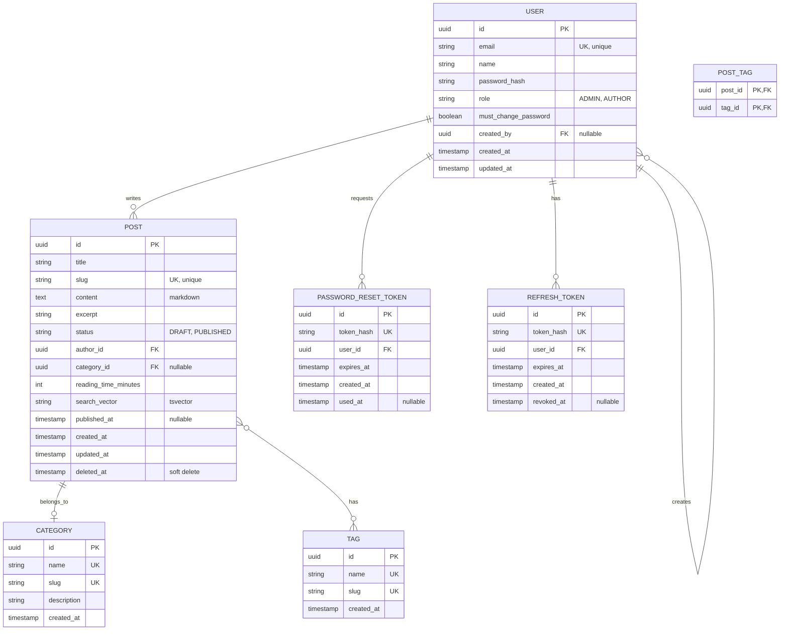

# Database Schema

> Entity Relationship Diagram for The Replicant blog platform.

---

## ER Diagram



---

## Table Details

### users
| Column | Type | Constraints | Description |
|--------|------|-------------|-------------|
| id | UUID | PK | Primary key |
| email | VARCHAR(255) | UNIQUE, NOT NULL | Login identifier |
| name | VARCHAR(100) | NOT NULL | Display name |
| password_hash | VARCHAR(255) | NOT NULL | BCrypt hashed |
| role | ENUM | NOT NULL | ADMIN or AUTHOR |
| must_change_password | BOOLEAN | DEFAULT true | Force change on first login |
| created_by | UUID | FK → users(id) | Who created this user |
| created_at | TIMESTAMP | DEFAULT NOW() | Creation time |
| updated_at | TIMESTAMP | AUTO UPDATE | Last modification |

### posts
| Column | Type | Constraints | Description |
|--------|------|-------------|-------------|
| id | UUID | PK | Primary key |
| title | VARCHAR(200) | NOT NULL | Post title |
| slug | VARCHAR(250) | UNIQUE, NOT NULL | URL-friendly identifier |
| content | TEXT | NOT NULL | Markdown content |
| excerpt | VARCHAR(300) | | Short description |
| status | ENUM | NOT NULL | DRAFT or PUBLISHED |
| author_id | UUID | FK → users(id) | Post author |
| category_id | UUID | FK → categories(id) | Optional category |
| reading_time_minutes | INT | | Calculated from word count |
| search_vector | TSVECTOR | | PostgreSQL full-text search |
| published_at | TIMESTAMP | | When first published |
| created_at | TIMESTAMP | DEFAULT NOW() | Creation time |
| updated_at | TIMESTAMP | AUTO UPDATE | Last modification |
| deleted_at | TIMESTAMP | NULLABLE | Soft delete marker |

### categories
| Column | Type | Constraints | Description |
|--------|------|-------------|-------------|
| id | UUID | PK | Primary key |
| name | VARCHAR(50) | UNIQUE, NOT NULL | Display name |
| slug | VARCHAR(60) | UNIQUE, NOT NULL | URL-friendly |
| description | VARCHAR(200) | | Category description |
| created_at | TIMESTAMP | DEFAULT NOW() | Creation time |

### tags
| Column | Type | Constraints | Description |
|--------|------|-------------|-------------|
| id | UUID | PK | Primary key |
| name | VARCHAR(50) | UNIQUE, NOT NULL | Tag name |
| slug | VARCHAR(60) | UNIQUE, NOT NULL | URL-friendly |
| created_at | TIMESTAMP | DEFAULT NOW() | Creation time |

### post_tags (Junction Table)
| Column | Type | Constraints | Description |
|--------|------|-------------|-------------|
| post_id | UUID | PK, FK → posts(id) | Post reference |
| tag_id | UUID | PK, FK → tags(id) | Tag reference |

### refresh_tokens
| Column | Type | Constraints | Description |
|--------|------|-------------|-------------|
| id | UUID | PK | Primary key |
| token_hash | VARCHAR(255) | UNIQUE | Hashed token value |
| user_id | UUID | FK → users(id) | Token owner |
| expires_at | TIMESTAMP | NOT NULL | Expiration time |
| created_at | TIMESTAMP | DEFAULT NOW() | Creation time |
| revoked_at | TIMESTAMP | NULLABLE | When token was invalidated |

### password_reset_tokens
| Column | Type | Constraints | Description |
|--------|------|-------------|-------------|
| id | UUID | PK | Primary key |
| token_hash | VARCHAR(255) | UNIQUE | Hashed token value |
| user_id | UUID | FK → users(id) | User requesting reset |
| expires_at | TIMESTAMP | NOT NULL | 1 hour from creation |
| created_at | TIMESTAMP | DEFAULT NOW() | Creation time |
| used_at | TIMESTAMP | NULLABLE | When token was used |

---

## Indexes

```sql
-- Performance indexes
CREATE INDEX idx_posts_slug ON posts(slug);
CREATE INDEX idx_posts_status ON posts(status) WHERE deleted_at IS NULL;
CREATE INDEX idx_posts_published_at ON posts(published_at DESC) WHERE status = 'PUBLISHED';
CREATE INDEX idx_posts_search ON posts USING GIN(search_vector);
CREATE INDEX idx_posts_author ON posts(author_id);
CREATE INDEX idx_posts_category ON posts(category_id);

-- Token cleanup
CREATE INDEX idx_refresh_tokens_expires ON refresh_tokens(expires_at);
CREATE INDEX idx_password_reset_expires ON password_reset_tokens(expires_at);
```

---

## Full-Text Search Setup

```sql
-- Trigger to auto-update search vector
CREATE OR REPLACE FUNCTION posts_search_trigger() RETURNS trigger AS $$
BEGIN
  NEW.search_vector := 
    setweight(to_tsvector('spanish', COALESCE(NEW.title, '')), 'A') ||
    setweight(to_tsvector('spanish', COALESCE(NEW.excerpt, '')), 'B') ||
    setweight(to_tsvector('spanish', COALESCE(NEW.content, '')), 'C');
  RETURN NEW;
END
$$ LANGUAGE plpgsql;

CREATE TRIGGER posts_search_update
  BEFORE INSERT OR UPDATE ON posts
  FOR EACH ROW
  EXECUTE FUNCTION posts_search_trigger();
```

---

**Document Version**: 1.0  
**Created**: 2026-01-19  
**Last Updated**: 2026-01-19
