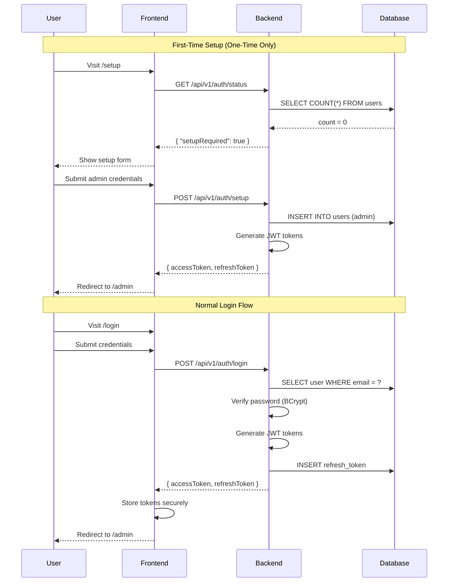
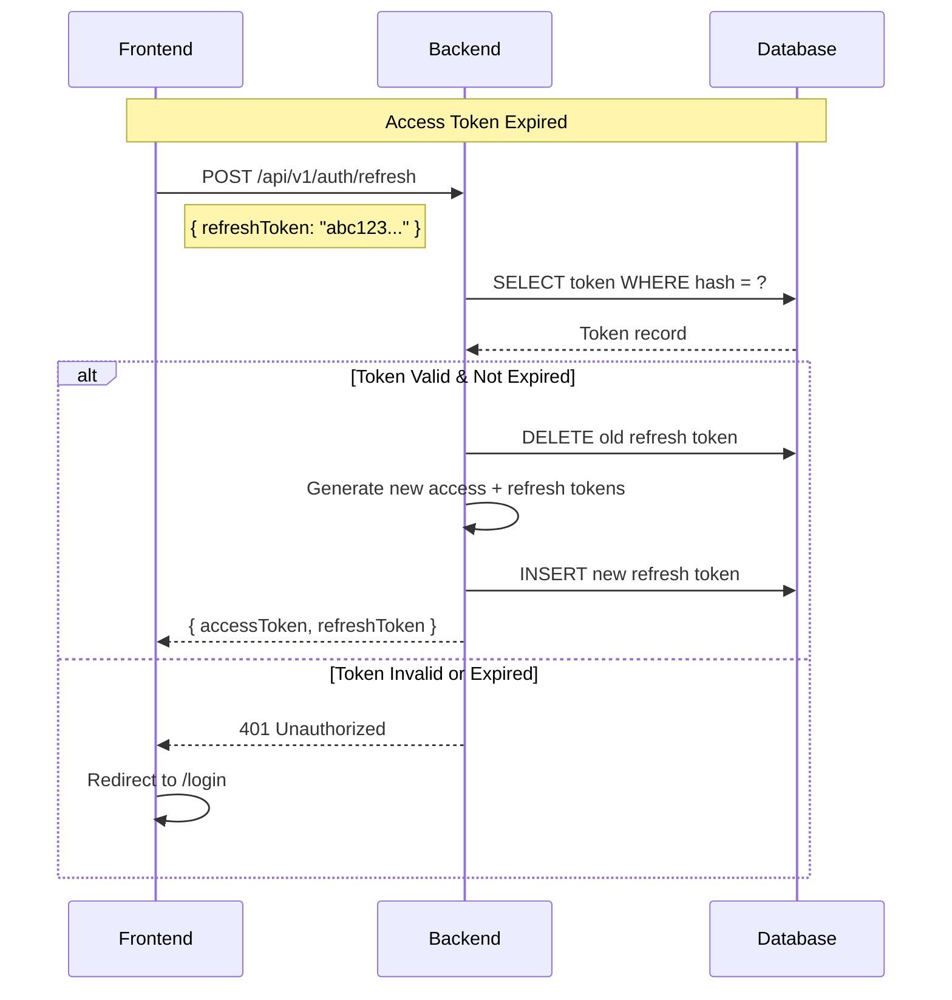
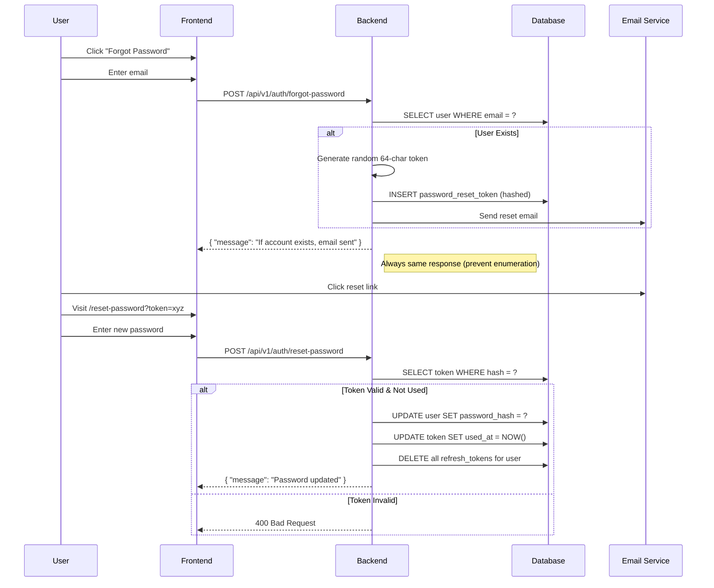
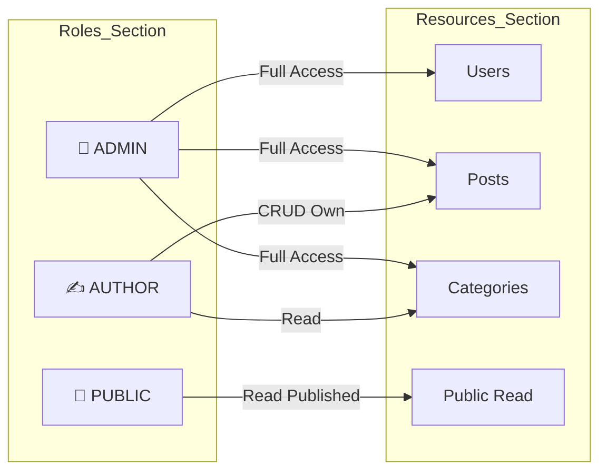

# Security Architecture

> Authentication flow, JWT lifecycle, and security model for The Replicant.

---

## Authentication Flow



---

## JWT Token Structure

### Access Token (Short-lived)

```json
{
  "header": {
    "alg": "HS256",
    "typ": "JWT"
  },
  "payload": {
    "sub": "user-uuid-here",
    "email": "admin@example.com",
    "role": "ADMIN",
    "iat": 1706000000,
    "exp": 1706086400
  }
}
```

| Claim | Description | Value |
|-------|-------------|-------|
| sub | User ID (UUID) | `"550e8400-e29b-41d4..."` |
| email | User email | `"admin@example.com"` |
| role | Authorization level | `"ADMIN"` or `"AUTHOR"` |
| iat | Issued at | Unix timestamp |
| exp | Expires at | iat + 24 hours |

### Refresh Token (Long-lived)
- Random 64-character string
- Stored **hashed** in database
- Valid for 7 days
- Single-use (rotated on refresh)

---

## Token Refresh Flow



---

## Password Recovery Flow



---

## Security Model

### Role-Based Access Control (RBAC)



### Endpoint Security Matrix

| Endpoint | Method | Public | Author | Admin |
|----------|--------|--------|--------|-------|
| `/api/v1/auth/login` | POST | ✅ | ✅ | ✅ |
| `/api/v1/auth/setup` | POST | ✅* | ❌ | ❌ |
| `/api/v1/posts` | GET | ✅ | ✅ | ✅ |
| `/api/v1/posts` | POST | ❌ | ✅ | ✅ |
| `/api/v1/posts/{id}` | PUT | ❌ | ✅** | ✅ |
| `/api/v1/posts/{id}` | DELETE | ❌ | ❌ | ✅ |
| `/api/v1/users` | GET | ❌ | ❌ | ✅ |
| `/api/v1/users` | POST | ❌ | ❌ | ✅ |

*Only when no users exist  
**Only own posts

---

## Security Headers

```java
// Spring Security Configuration
http.headers()
    .contentSecurityPolicy("default-src 'self'")
    .and()
    .frameOptions().deny()
    .and()
    .xssProtection().enable()
    .and()
    .httpStrictTransportSecurity()
        .maxAgeInSeconds(31536000)
        .includeSubDomains(true);
```

| Header | Value | Purpose |
|--------|-------|---------|
| Content-Security-Policy | `default-src 'self'` | Prevent XSS |
| X-Frame-Options | `DENY` | Prevent clickjacking |
| X-Content-Type-Options | `nosniff` | Prevent MIME sniffing |
| Strict-Transport-Security | `max-age=31536000` | Force HTTPS |
| X-XSS-Protection | `1; mode=block` | XSS filter |

---

## Rate Limiting

| Endpoint | Limit | Window | Action on Exceed |
|----------|-------|--------|------------------|
| Login | 5 attempts | 15 min | Delay response |
| Login | 10 attempts | 30 min | Account lockout |
| Password Reset | 3 requests | 1 hour | Silent ignore |
| User Creation | 5 users | 1 hour | 429 Error |
| API (general) | 100 requests | 1 min | 429 Error |

---

## Audit Logging

All security events are logged:

```java
@Slf4j
public class SecurityAuditLogger {
    
    public void logLoginAttempt(String email, boolean success, String ip) {
        log.info("LOGIN_ATTEMPT email={} success={} ip={}", 
                 maskEmail(email), success, ip);
    }
    
    public void logPasswordReset(UUID userId, String ip) {
        log.info("PASSWORD_RESET userId={} ip={}", userId, ip);
    }
    
    public void logUserCreated(UUID creatorId, UUID newUserId) {
        log.info("USER_CREATED by={} new={}", creatorId, newUserId);
    }
}
```

---

**Document Version**: 1.0  
**Created**: 2026-01-19  
**Last Updated**: 2026-01-19
