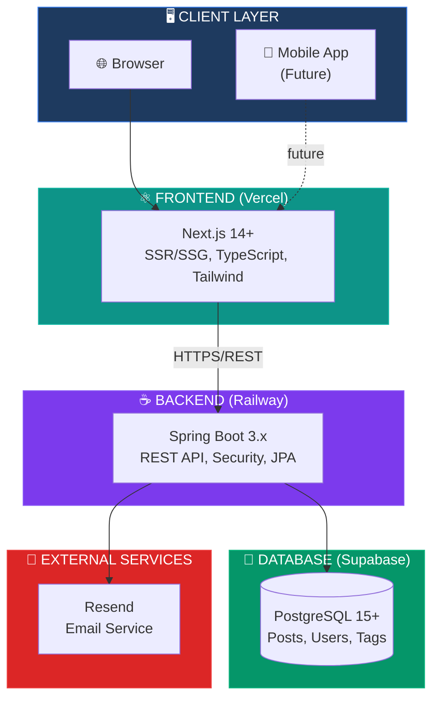

# System Architecture

> High-level architecture for The Replicant blog platform.

---

## Overview

The Replicant follows a modern **API-First** architecture with clear separation between frontend and backend. This enables future expansion to mobile apps or alternative frontends.

---

## Architecture Diagram



---

## Component Responsibilities

### Frontend (Next.js)
| Responsibility | Implementation |
|----------------|----------------|
| Public pages (SSG) | Homepage, Post detail, Categories |
| Admin dashboard (SSR) | Protected routes with token validation |
| API client | Auto-generated from OpenAPI spec |
| State management | TanStack Query for server state |
| Styling | TailwindCSS with custom theme |

### Backend (Spring Boot)
| Responsibility | Implementation |
|----------------|----------------|
| REST API | Controllers, DTOs, Validation |
| Authentication | JWT tokens, Spring Security |
| Data access | JPA/Hibernate repositories |
| Business logic | Service layer with transactions |
| API documentation | OpenAPI 3.0 (Swagger UI) |

### Database (PostgreSQL)
| Responsibility | Implementation |
|----------------|----------------|
| Data persistence | Primary storage for all entities |
| Full-text search | PostgreSQL tsvector for post search |
| Indexing | Optimized queries for common operations |

---

## Data Flow

```
┌──────────────────────────────────────────────────────────────────────────────┐
│                         PUBLIC READ FLOW (SSG)                                │
└──────────────────────────────────────────────────────────────────────────────┘

  User              Next.js            Spring Boot          PostgreSQL
   │                   │                    │                    │
   │  Visit            │                    │                    │
   │  /blog/my-post    │                    │                    │
   │──────────────────>│                    │                    │
   │                   │                    │                    │
   │                   │ GET                │                    │
   │                   │ /api/v1/posts/     │                    │
   │                   │ my-post            │                    │
   │                   │───────────────────>│                    │
   │                   │                    │                    │
   │                   │                    │ SELECT * FROM      │
   │                   │                    │ posts WHERE        │
   │                   │                    │ slug = ?           │
   │                   │                    │───────────────────>│
   │                   │                    │                    │
   │                   │                    │     Post data      │
   │                   │                    │<───────────────────│
   │                   │                    │                    │
   │                   │   JSON response    │                    │
   │                   │<───────────────────│                    │
   │                   │                    │                    │
   │  Rendered HTML    │                    │                    │
   │  (cached)         │                    │                    │
   │<──────────────────│                    │                    │


┌──────────────────────────────────────────────────────────────────────────────┐
│                           ADMIN WRITE FLOW                                    │
└──────────────────────────────────────────────────────────────────────────────┘

  User              Next.js            Spring Boot          PostgreSQL
   │                   │                    │                    │
   │  Submit new post  │                    │                    │
   │──────────────────>│                    │                    │
   │                   │                    │                    │
   │                   │ POST               │                    │
   │                   │ /api/v1/posts      │                    │
   │                   │ (+ JWT)            │                    │
   │                   │───────────────────>│                    │
   │                   │                    │                    │
   │                   │                    │ Validate JWT       │
   │                   │                    │ (internal)         │
   │                   │                    │                    │
   │                   │                    │ INSERT INTO posts  │
   │                   │                    │───────────────────>│
   │                   │                    │                    │
   │                   │                    │   Created post     │
   │                   │                    │<───────────────────│
   │                   │                    │                    │
   │                   │   201 Created      │                    │
   │                   │<───────────────────│                    │
   │                   │                    │                    │
   │  Success          │                    │                    │
   │  notification     │                    │                    │
   │<──────────────────│                    │                    │
```

---

## Technology Decisions

### Why Spring Boot?
- Mature ecosystem for REST APIs
- Excellent security with Spring Security
- Strong typing with Java 21
- OpenAPI integration out of the box

### Why Next.js?
- Best-in-class SSR/SSG for SEO
- React ecosystem and component reuse
- Vercel deployment is free and fast
- TypeScript for type safety across stack

### Why PostgreSQL?
- Robust full-text search (no Elasticsearch needed for MVP)
- Free tier on Supabase
- Reliable and battle-tested
- Easy migration path if scaling needed

---

## Scalability Considerations

| Component | Current (MVP) | Future Scale |
|-----------|---------------|--------------|
| Frontend | Vercel Edge | Same (auto-scales) |
| Backend | Single Railway instance | Horizontal scaling |
| Database | Supabase Free | Supabase Pro or dedicated |
| Caching | PostgreSQL query cache | Add Redis layer |
| CDN | Vercel built-in | Same |

---

**Document Version**: 1.0  
**Created**: 2026-01-19  
**Last Updated**: 2026-01-19
